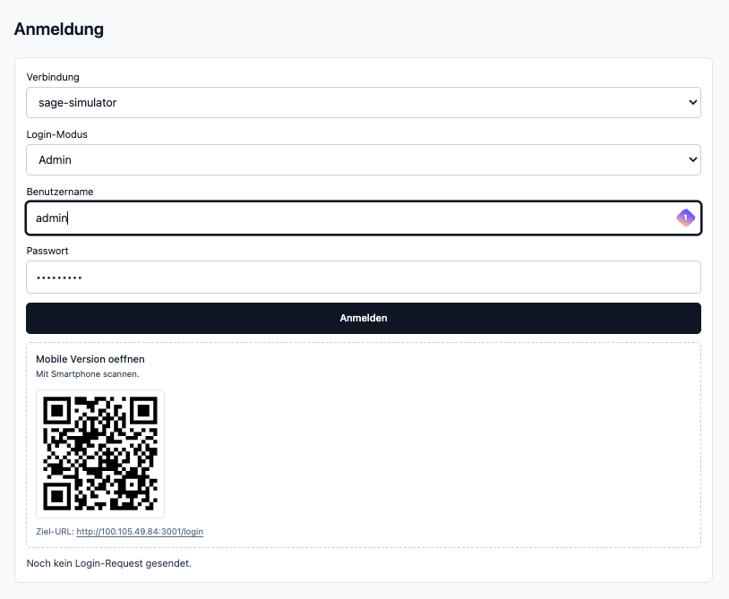
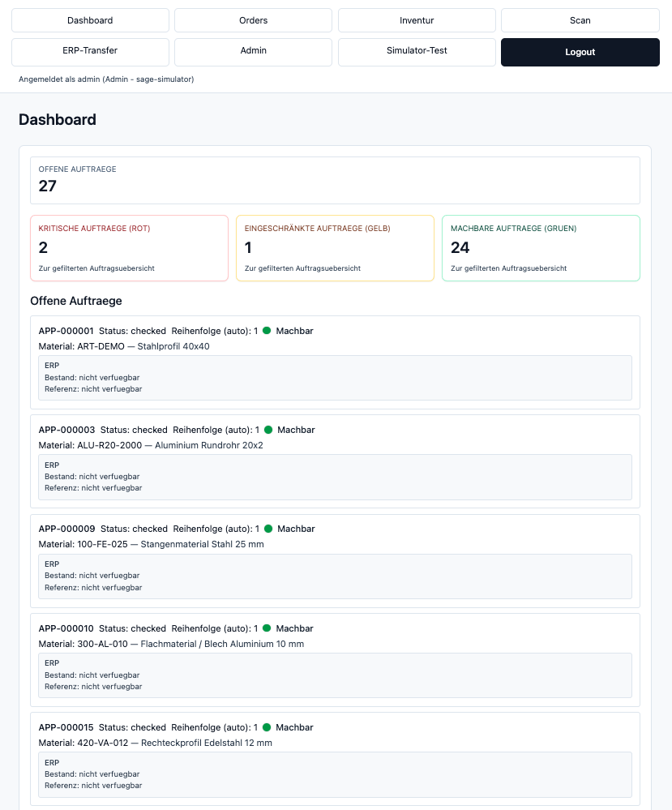
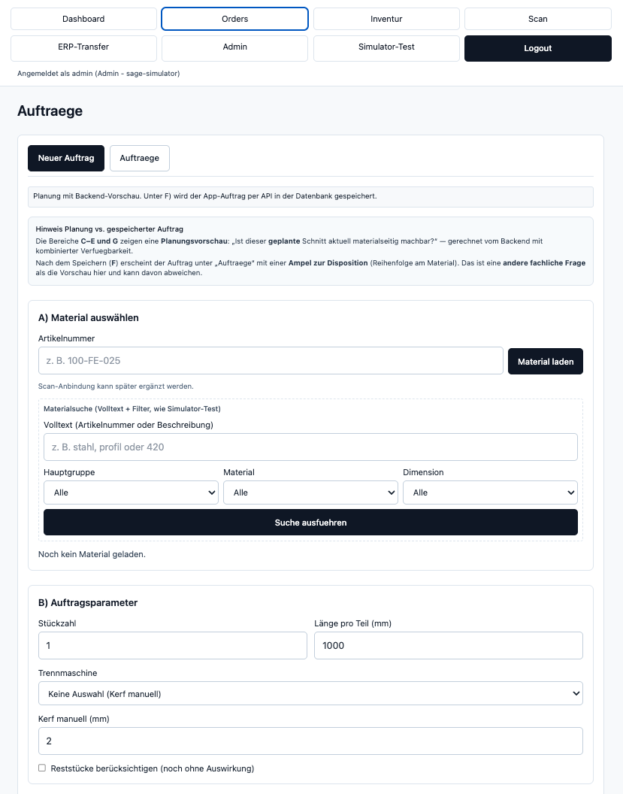
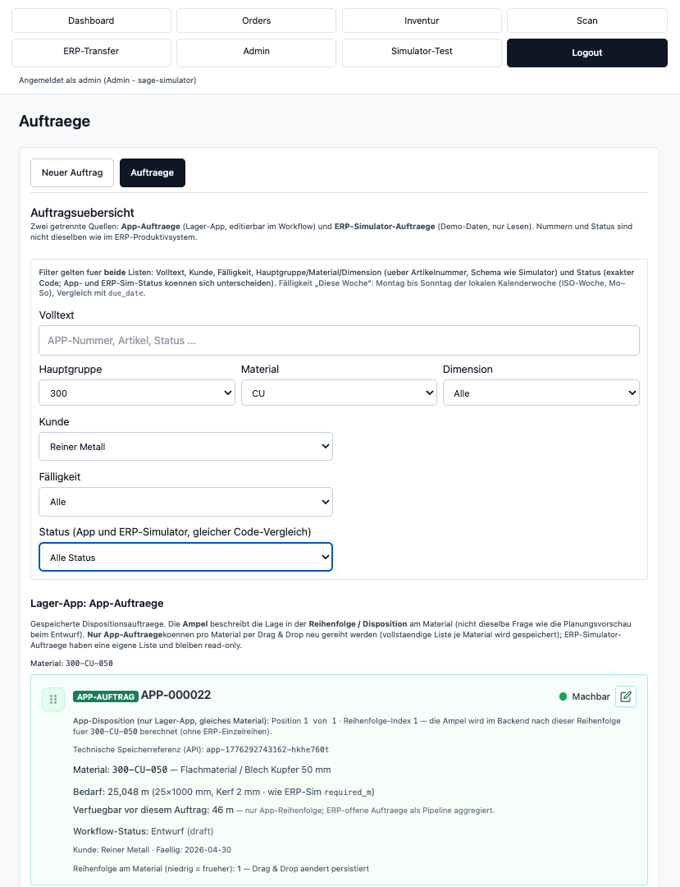
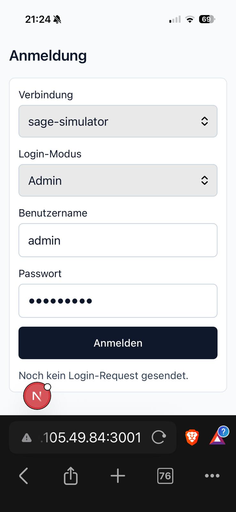

# Smart Disposition Layer

## 1. Ziel

- Die App ist eine **dispositive Planungsschicht** für Stangenmaterial.
- Das **ERP** bleibt das führende System für Bestände, Materialstammdaten und Aufträge.
- Das **Backend** berechnet die Materialverfügbarkeit und die Ampelbewertung; das Frontend stellt die Ergebnisse nur dar.

---

## 2. Grundprinzip

- Verfügbarkeit wird **sequenziell** je Material ermittelt.
- Die **Reihenfolge** der Aufträge beeinflusst das Ergebnis.
- Es findet **keine globale Optimierung** statt.

---

## 3. Sequenzielle Disposition

Die Bewertung erfolgt pro Material in der festgelegten Auftragsreihenfolge:

Order A → Order B → Order C

Jeder Auftrag verändert den verbleibenden verfügbaren Bestand für die nachfolgenden Aufträge.

---

## 4. Beispiel

Startbestand: **10 m**, drei App-Aufträge mit je **4 m**.

| Schritt | Auftrag | Bedarf | Verfügbar davor | Ergebnis |
| ------- | ------- | ------ | --------------- | -------- |
| 1       | A       | 4 m    | 10 m            | Grün     |
| 2       | B       | 4 m    | 6 m             | Grün     |
| 3       | C       | 4 m    | 2 m             | Rot      |

Der letzte Auftrag ist nicht mehr vollständig erfüllbar und wird **rot** bewertet.

---

## 5. Ampellogik

- **Grün** → vollständig erfüllbar
- **Gelb** → nur mit Reststücken erfüllbar
- **Rot** → nicht erfüllbar

Wichtig:

- **Kein Abbruch** der Bewertung, auch wenn der verfügbare Bestand negativ wird.
- Die **komplette Sequenz** wird bewertet; nachfolgende Aufträge erhalten weiterhin ihre Ampel.

---

## 6. Wichtige Kennzahl

### `disposition_available_before_mm`

- Verfügbarkeit (Stückgut in mm) **unmittelbar vor** der Bewertung eines Auftrags in der Sequenz.
- **Abhängig von der Reihenfolge** der Aufträge je Material.
- Wird **im Backend** berechnet.
- Wird **nicht in der Datenbank gespeichert** (abgeleiteter Wert).

---

## 7. Architektur-Einordnung

- **Domain** → Dispositionslogik und Ampelbewertung
- **Application** → Use Cases (Anreicherung, Aggregation, sequenzielle Bewertung)
- **API** → liefert Bewertungs- und Aggregationsergebnisse als DTO-Felder
- **Frontend** → Darstellung und Filter auf bereits gelieferten Feldern (keine eigene Berechnung)

---

## 8. Screenshots

### Desktop – Anmeldung

### Desktop – Dashboard

### Desktop – Auftrag erstellen

### Desktop – Auftragsliste

### Mobile – Login

---

## 9. PDF-Version

- [`docs/Smart_Disposition_Layer.pdf`](Smart_Disposition_Layer.pdf)
